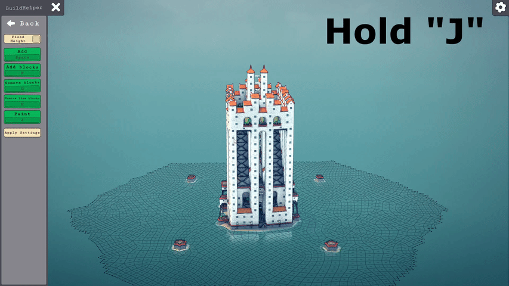
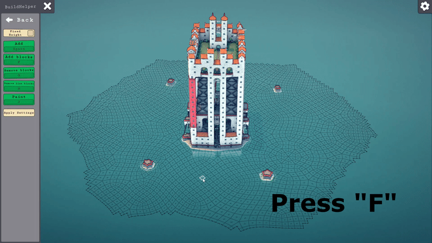
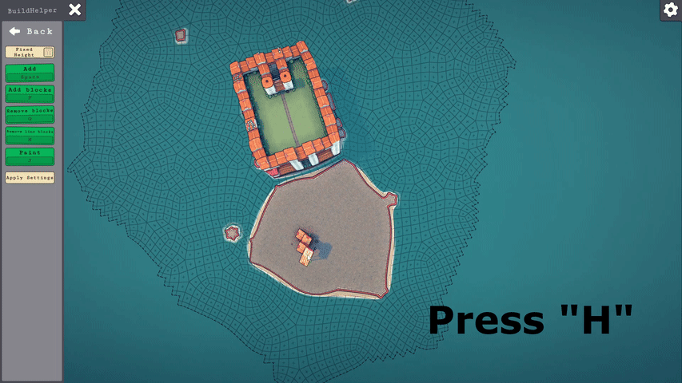
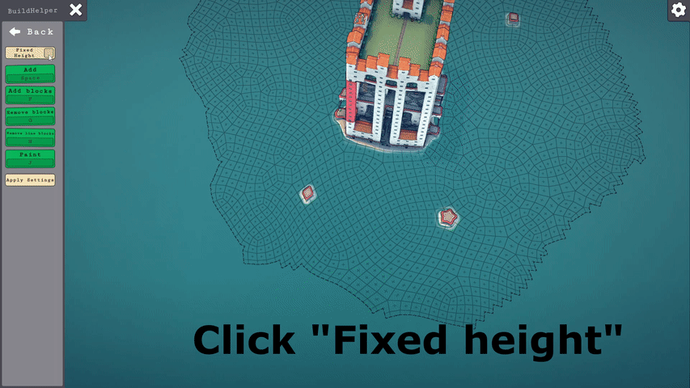

# Townscaper-BuildHelper
 A mod to build faster and easier in Townscaper

# Features

- Painter : keep pressing "J" to paint the blocks with your chosen color.

- Add ("F") and Remove ("G") a group of blocks

- Remove a line of blocks like an eraser beam, press "H"

- Add blocks ("Space") or a group of blocks ("F") at the specified height using "LeftCtrl" and "LeftAlt" to manage the height.

# Installation

1. Download "Melon Loader" by LavaGang:
https://github.com/LavaGang/MelonLoader/releases/latest/

2. Start the MelonLoader.Installer.exe

2.1. Click "Select" and navigate to your Townscaper folder and select the Townscaper.exe (usually: C:\Program Files(x86)\Steam\steamapps\common\Townscaper\Townscaper.exe)

2.2. Untick the "Latest" checkbox and choose version 0.4.3

2.3. Click install 

2.4. During the installation a "Mods" folder gets created it your game folder. MelonLoader does not(!) change any game files. 
	 You can uninstall anytime through the installer or by deleting the "version.dll" file.

3. Download the mod (latest release) by clicking [here]()

4. Extract all the files from "BuildHelper.zip" into your games Mods folder.

5. Download the utility mod "ModUI" (latest release) from: https://github.com/DigitalzombieTLD/TownscaperModUI/releases/latest/

6. Extract the all files from the ModUI download into your games Mods folder

7. Start the game !

8. The menu can be found here :

# Advanced feature

You can modify keyboard shortcuts by clicking them and pressing the wanted key. Then press "Apply Settings".